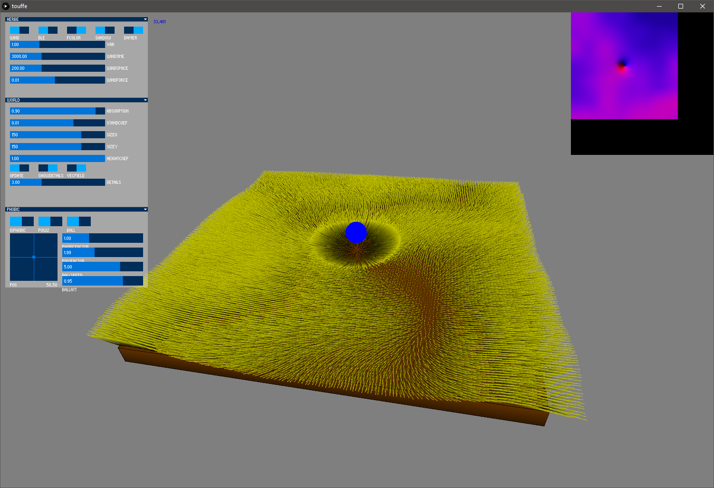

# wind_simulator

A simple [processing](https://processing.org/) (and not so realistic) simulation of wind into a field.

## GUI

The project incudes a gui that enable you to interact with the parameters.